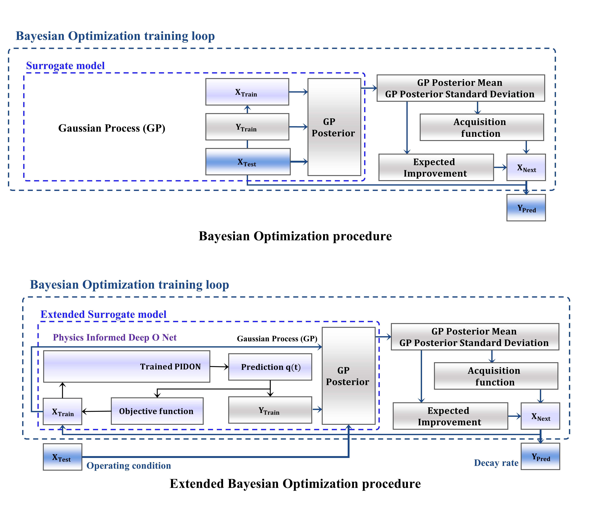

# **A Study on Decay Rate Analysis Based on Extended Bayesian Optimization**

Piezoelectric inkjet printing is a high-precision droplet ejection technology widely used in emerging applications, including printed electronics, bioprinting, microfabrication, and functional material deposition. However, the formation of defective droplets remains a critical issue because droplet behavior is highly sensitive to ink properties, nozzle geometry, and the driving conditions of the piezoelectric actuator. In particular, real-time stability analysis is essential, as interfacial dynamics vary continuously with the volumetric flow rate during droplet generation. In this study, the objective was to track droplet properties according to changes in the interfacial volumetric flow rate. For this purpose, a Physics-Informed Neural Network (PINN) was constructed to predict ink properties, and the surrogate model in Bayesian optimization was extended to incorporate these physics-informed predictions. Using the interfacial volumetric flow-rate variations obtained under different ink-property and voltage conditions, the decay rate was quantitatively analyzed. The proposed approach makes it possible to identify optimal operating voltage conditions for real-time decay-rate evaluation and stable droplet generation in piezoelectric inkjet printing.

  

<strong>Fig 1. Schematic diagram of the Extended Bayesian Optimization.</strong>

